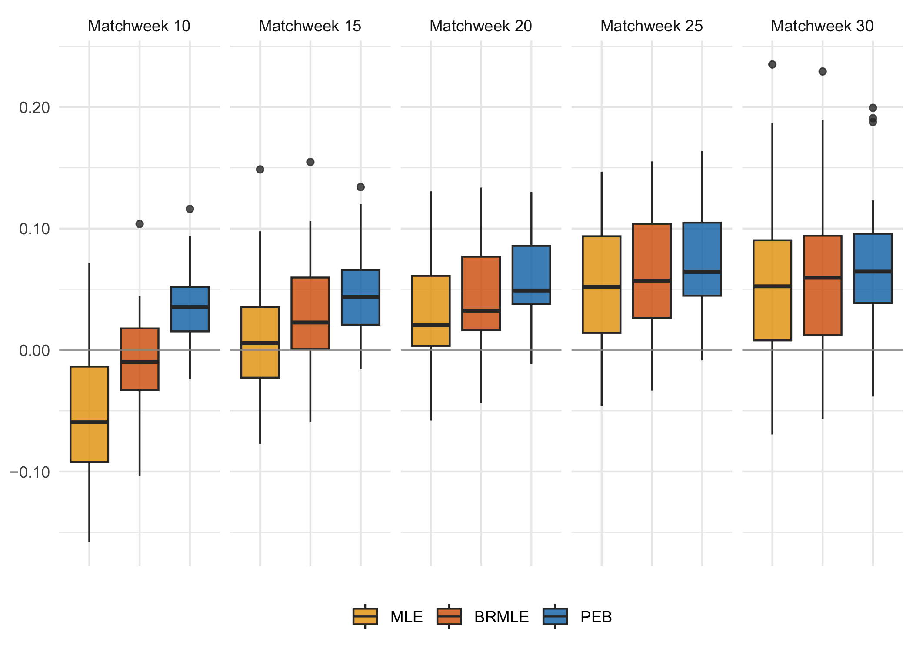

<!-- README.md is generated from README.Rmd. Please edit that file -->

# Tractable Ridge Regression for Paired Comparisons

This document illustrates how to use the R (R Core Team, 2024) code
accompanying [Varin and Firth (2024)](https://arxiv.org/abs/2406.09597)
to replicate the analysis of the last 28 seasons of English Premier
League. The figures in the paper differ in minor respects from those
produced in this document due to some manual editing for inclusion in
the paper.

<!-- badges: start -->
<!-- badges: end -->

Load some libraries that will be used in this document:

``` r
library("dplyr")
library("tidyr")
library("ggplot2")
library("signs")
```

Load the code that implements the methodology discussed in [Varin and
Firth (2024)](https://arxiv.org/abs/2406.09597):

``` r
source("peb.R")
```

Ridge regression for paired comparisons with the pairwise empirical
Bayes method is implemented in the`peb` function:

``` r
peb <- function(tournament, lambda = NULL, home_effect = FALSE, a = 2 * nlevels(tournament$home), eps = 1e-4, ...)
```

The main argument of `peb` is `tournament`. The code assumes that
`tournament` is a `data.frame` with at least three columns called
`home`, `away` and `outcome`. Columns `home` and `away` are factors that
identify the teams playing at home and away, respectively. Column
`outcome` is the outcome of the match coded as `1` in case of victory of
the away team, `2` in case of draw and `3` in case of victory of the
home team. Further arguments of `peb` are:

- the ridge tuning parameter `lambda`. The default value is `NULL` in
  which case $\lambda$ is estimated by the pairwise empirical Bayes
  method;
- the logical variable `home_effect` that indicates whether a home-field
  effect parameter has to be included (`TRUE`) or not (`FALSE`);
- the small-sample adjustment parameter `a`. The default value for `a`
  is `2 * levels(tournament$data)` which corresponds in adding one
  imaginary concordant couple and one imaginary discordant couple of
  paired comparisons to each of the teams, as discussed in the paper.
  Estimation without the small-sample adjustment is obtained with `a=0`.

Please refer to [Varin and Firth
(2024)](https://arxiv.org/abs/2406.09597) for further details on the
meaning of the quantities indicated above.

Load English Premier League results for the seasons 1995-1996 to
2022-2023:

``` r
load("premier_1995-2023.RData")
```

The loaded object is a `data.frame` with the results of all 10640
matches in the 28 seasons from 1995-1996 to 2022-2023:

``` r
class(premier_data)
#> [1] "data.table" "data.frame"
```

``` r
head(premier_data)
#>         date week          home            away outcome    season
#> 1 1995-08-19    1   Southampton Nott'ham Forest       1 1995-1996
#> 2 1995-08-19    1 Newcastle Utd   Coventry City       3 1995-1996
#> 3 1995-08-19    1     Wimbledon          Bolton       3 1995-1996
#> 4 1995-08-19    1     Liverpool  Sheffield Weds       3 1995-1996
#> 5 1995-08-19    1      West Ham    Leeds United       1 1995-1996
#> 6 1995-08-19    1     Blackburn             QPR       3 1995-1996
```

The long-term proportions of home wins, draws and away wins are

``` r
options(digits = 2)
ref_probs <- prop.table(table(premier_data$outcome))
ref_probs
#> 
#>    1    2    3 
#> 0.29 0.25 0.46
```

For illustration, let us fit the paired comparison model to season
2015/2016 without home-field effect:

``` r
season_1516 <- premier_data %>%
  filter(season == "2015-2016") 
fit <- peb(season_1516, home_effect = FALSE)
```

The fitted object is a `list` with various components:

``` r
class(fit)
#> [1] "list"
```

``` r
names(fit)
#>  [1] "ties"        "home_effect" "delta"       "gamma"       "tau"        
#>  [6] "lambda"      "X"           "lik"         "score"       "mu"
```

Among the components of `fit` are the model parameters $\gamma$ and
$\delta$:

``` r
fit$gamma
#> [1] 0.37
```

``` r
fit$delta
#> [1] 0
```

The estimate of $\delta$ is set equal to zero since no home-field effect
is assumed. The tuning parameter $\lambda$ estimated with the pairwise
empirical Bayes method is

``` r
fit$lambda
#> [1] 8.1
```

The most relevant component of `fit` is the vector $\mu$ of the
estimated strength parameters, below ordered from best to worst rated
team:

``` r
sort(fit$mu, decreasing = TRUE)
#>  Leicester City         Arsenal       Tottenham  Manchester Utd Manchester City 
#>           0.562           0.368           0.365           0.256           0.252 
#>        West Ham     Southampton       Liverpool         Chelsea       Blackburn 
#>           0.209           0.191           0.168           0.011           0.000 
#>          Bolton   Coventry City    Leeds United   Middlesbrough Nott'ham Forest 
#>           0.000           0.000           0.000           0.000           0.000 
#>             QPR  Sheffield Weds       Wimbledon    Derby County        Barnsley 
#>           0.000           0.000           0.000           0.000           0.000 
#>    Charlton Ath   Bradford City    Ipswich Town          Fulham Birmingham City 
#>           0.000           0.000           0.000           0.000           0.000 
#>      Portsmouth          Wolves  Wigan Athletic         Reading   Sheffield Utd 
#>           0.000           0.000           0.000           0.000           0.000 
#>       Hull City         Burnley       Blackpool    Cardiff City        Brighton 
#>           0.000           0.000           0.000           0.000           0.000 
#>    Huddersfield       Brentford      Stoke City         Everton    Swansea City 
#>           0.000           0.000          -0.022          -0.052          -0.083 
#>       West Brom         Watford     Bournemouth  Crystal Palace      Sunderland 
#>          -0.129          -0.145          -0.193          -0.196          -0.225 
#>   Newcastle Utd    Norwich City     Aston Villa 
#>          -0.278          -0.361          -0.697
```

Now, we refit the model with the inclusion of the home-field effect:

``` r
fit2 <- peb(season_1516, home_effect = TRUE)
```

The estimates of the model parameters and the tuning parameter become

``` r
fit2$gamma
#> [1] 0.37
```

``` r
fit2$delta
#> [1] 0.14
```

``` r
fit2$lambda
#> [1] 9.1
```

The corresponding vector of estimated strength parameters is

``` r
sort(fit2$mu, decreasing = TRUE)
#>  Leicester City         Arsenal       Tottenham Manchester City  Manchester Utd 
#>          0.5491          0.3629          0.3562          0.2530          0.2502 
#>        West Ham     Southampton       Liverpool         Chelsea       Blackburn 
#>          0.2046          0.1890          0.1594          0.0072          0.0000 
#>          Bolton   Coventry City    Leeds United   Middlesbrough Nott'ham Forest 
#>          0.0000          0.0000          0.0000          0.0000          0.0000 
#>             QPR  Sheffield Weds       Wimbledon    Derby County        Barnsley 
#>          0.0000          0.0000          0.0000          0.0000          0.0000 
#>    Charlton Ath   Bradford City    Ipswich Town          Fulham Birmingham City 
#>          0.0000          0.0000          0.0000          0.0000          0.0000 
#>      Portsmouth          Wolves  Wigan Athletic         Reading   Sheffield Utd 
#>          0.0000          0.0000          0.0000          0.0000          0.0000 
#>       Hull City         Burnley       Blackpool    Cardiff City        Brighton 
#>          0.0000          0.0000          0.0000          0.0000          0.0000 
#>    Huddersfield       Brentford      Stoke City         Everton    Swansea City 
#>          0.0000          0.0000         -0.0220         -0.0461         -0.0813 
#>       West Brom         Watford  Crystal Palace     Bournemouth      Sunderland 
#>         -0.1248         -0.1449         -0.1865         -0.1903         -0.2205 
#>   Newcastle Utd    Norwich City     Aston Villa 
#>         -0.2770         -0.3558         -0.6824
```

Now we load the function that is used to calculate the comparison
methods which are maximum likelihood and bias-reduced maximum
likelihood. Estimates with these methods are calculated with the
`bpolr.R` function of Kosmidis (2014). This function can be downloaded
from Ioannis Kosmidis’ [web page](https://www.ikosmidis.com/):

``` r
library("archive")
url_address <- "https://www.ikosmidis.com/files/rssb12025-sup-0002-supplementary-materials-ikosmidis.zip"
archive_extract(url_address, dir = "tmp")
source("tmp/supplementary/bpolr.R")
```

The next lines replicate the forecasting exercises of [Varin and Firth
(2024)](https://arxiv.org/abs/2406.09597). For each season, paired
comparison models are trained with the first $k$ matchweeks (with
$k=10, 15, 20, 25, 30$) and then validated by predicting the rest of the
tournament:

``` r
train_weeks <- seq(10, 30, by = 5)
n_weeks <- length(train_weeks)
methods <- c("PEB", "MLE", "BRMLE")
n_methods <- length(methods)
seasons <- unique(premier_data$season)
n_seasons <- length(seasons)
premier_skill_scores <- data.frame(season = rep(seasons, each = n_methods * n_weeks), week = rep(rep(train_weeks, each = n_methods, n_seasons)), skill_score = NA, method = rep(rep(methods, n_seasons), n_weeks))
premier_skill_scores$method <- factor(premier_skill_scores$method, levels = c("MLE", "BRMLE", "PEB"))

for (s in seasons) {
  for (w in train_weeks) {
    this_season <- premier_data %>% filter(season == s)
    this_season <- droplevels(this_season)
    train_set <- this_season %>% filter(week <= w)
    test_set <- this_season %>% filter(week > w)
    peb_fit <- peb(train_set, home_effect = TRUE, a = 40)
    mle_fit <- brmle(train_set, br = FALSE, maxit = 5000)
    br_fit <- brmle(train_set, br = TRUE, maxit = 5000)
    rows <- which(premier_skill_scores$season == s & 
                  premier_skill_scores$week == w)
    premier_skill_scores[rows, "skill_score"] <- 
      c(compute_skillscore(peb_fit, test_set, "probit", ref_probs),
        compute_skillscore(mle_fit, test_set, "logit", ref_probs),
        compute_skillscore(br_fit, test_set, "logit", ref_probs))
  }
}
```

The results of the forecasting exercises are summarized in Figure 2 of
[Varin and Firth (2024)](https://arxiv.org/abs/2406.09597) which reports
the boxplot summary of the distributions of the logarithmic skill scores
calculated after 10, 15, 20, 25 and 30 weeks of matches:

``` r
## select a set of colors that are safe for colorblind people:
my_colors <- c("#E69F00", "#D55E00", "#0072B2")
ref_color <- "#999999"

my_theme <- theme_minimal() +
  theme(axis.title.x = element_text(),
        axis.title.y = element_text(angle = 0))
    
boxplot_premier <- function() {
  week_names <- as_labeller(
      c(`10` = "Matchweek 10", 
        `15` = "Matchweek 15",
        `20` = "Matchweek 20", 
        `25` = "Matchweek 25",
        `30` = "Matchweek 30"))

  my_plot <- premier_skill_scores %>% 
    ggplot(aes(y = skill_score, x = method, fill = method)) +
    geom_boxplot(alpha = 0.8) +
    facet_wrap(~week, ncol = 5, labeller = week_names) + 
    geom_hline(aes(yintercept = 0.0), col = ref_color, alpha = 0.8) +
    scale_y_continuous(labels = signs_format(accuracy = .01)) +
    scale_fill_manual(values = my_colors) +
    labs(x = NULL, y = NULL, fill = NULL) + 
    my_theme +
    theme(axis.text.x = element_blank(), 
          legend.position = "bottom")
  ## 
  my_plot
}
boxplot_premier() 
```



## References

Kosmidis I. (2014). [Improved estimation in cumulative link
models](https://academic.oup.com/jrsssb/article/76/1/169/7075945).
*Journal of the Royal Statistical Society Series B: Statistical
Methodology* **76**(1), 169–196.

R Core Team (2024). *R: A Language and Environment for Statistical
Computing*. R Foundation for Statistical Computing, Vienna, Austria.
<https://www.R-project.org/>.

Varin C. and Firth D. (2024). Tractable Ridge Regression for Paired
Comparisons. <https://arxiv.org/abs/2406.09597>
